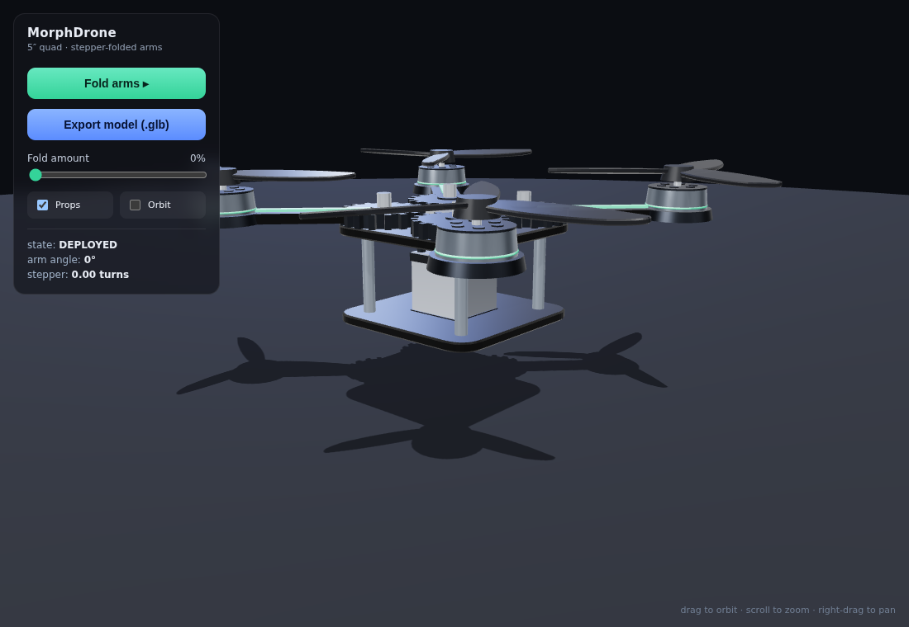
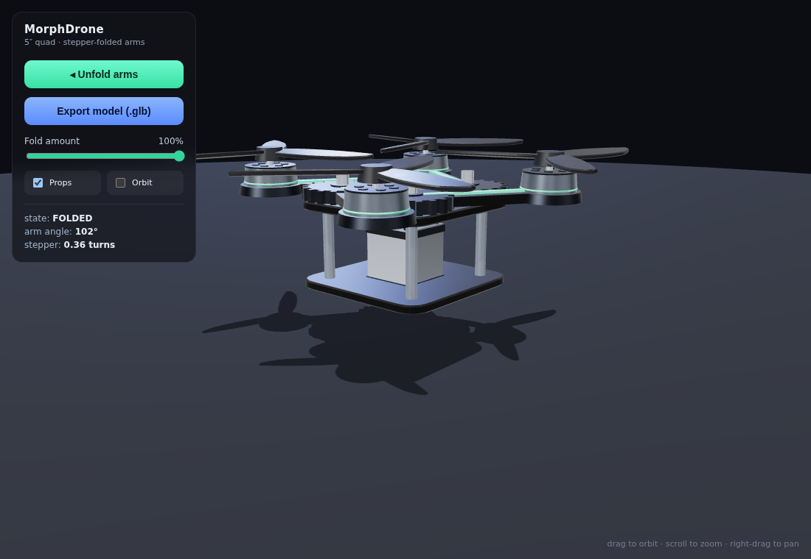

# MorphDrone — interactive 3D foldable quad

A high-quality, real-time 3D model of a 5-inch quadcopter whose **arms fold and
deploy at the press of a button**, driven by a central **stepper motor + gear
train**. Built with Three.js (WebGL, PBR materials, real-time reflections and
soft shadows). No build step — it's a single `index.html`.




## What it shows
- Carbon-fiber frame (stacked plates + standoffs), brushless motors with
  spinning 3-blade props, anodized motor mounts.
- A NEMA-style **stepper motor** in the center with an output gear that meshes
  with a gear at each arm hinge. Pressing **Fold** turns the stepper; all four
  arm gears rotate together and the arms swing in (pinwheel fold) so the
  footprint shrinks — then **Unfold** reverses it. The readout shows the live
  arm angle and how many turns the stepper has made.

## Controls
- **Fold / Unfold arms** button — smooth eased motion (the "stepper" driving).
- **Fold amount** slider — scrub the fold from 0–100% by hand.
- **Props / Orbit** toggles — prop spin and auto-rotate.
- **Export model (.glb)** — download the current model as a standard glTF binary
  you can open in Blender, Windows 3D Viewer, etc.
- Mouse: **drag** orbit · **scroll** zoom · **right-drag** pan.

## Run it
The model code loads Three.js from a CDN, so the simplest reliable way is a tiny
local web server (avoids browser `file://` module restrictions):

```bash
cd drone3d
python3 -m http.server 8000
# then open http://localhost:8000 in your browser
```

(Double-clicking `index.html` may also work in Chrome; the local server is the
sure path, and is needed in Firefox.)

> Needs internet access the first time to fetch Three.js from unpkg. Want a
> fully offline copy (vendored Three.js, no CDN)? Ask and I'll bundle it.

## Tuning the model
Open `index.html` and look near the top of the `<script type="module">`:
- `FOLD_MAX` — how far the arms swing when folded (radians).
- `Rc`, `Ra` — central vs. arm gear radii (sets the stepper gear ratio / turns).
- `ARM_LEN`, plate `r`, motor/prop sizes — overall airframe proportions.
- Materials (`matCarbon`, `matAlu`, …) — colors, roughness, metalness.
